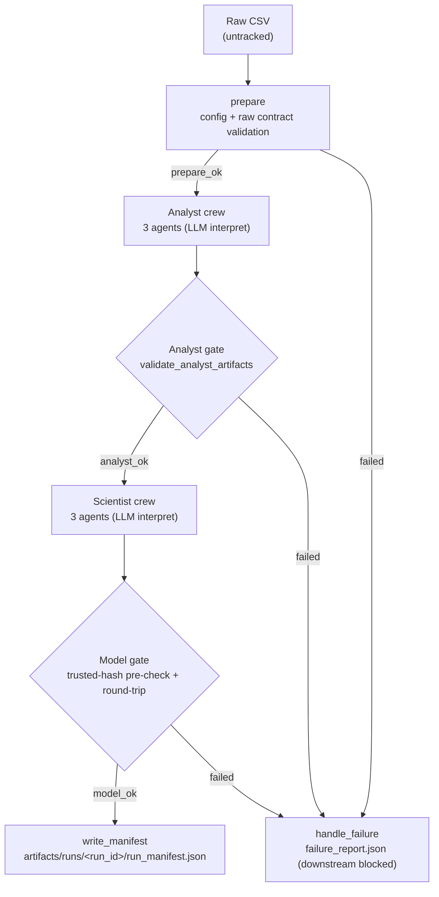

# Retail Clickstream AI

Industry-simulated AI product workflow that predicts the **next main product
category** a shopper will view within an online-shopping session. A single
**CrewAI Flow** orchestrates two three-agent crews (Analyst → Scientist) over
deterministic, tested Python pipelines and validators, and the result is surfaced
through a **Streamlit** app.

Everything needed to install, run, and audit the system is below. Installing,
importing, and running the offline test suite need **no API key and no network
access**; an OpenAI key is required only for the live-LLM run mode.

---

## 1. Project outcome and business question

**Business question:** *Given what a shopper has done so far in this session, which
main product category will they look at next?* (`trousers`, `skirts`, `blouses`,
or `sale`.)

**Outcome:** a leakage-safe, fully reproducible pipeline that trains three
candidate models on a chronological split and evaluates the winner **once** on a
held-out future month. The winning model is a **current-category transition
baseline** — browsing is strongly category-sticky, and the baseline reaches a
**held-out test macro-F1 of 0.8195** (accuracy 82.4%), honestly beating two
stronger model families by a small margin. Every reported number traces to a
machine-readable file; no metric is authored by an LLM. See
[Model & evaluation summary](#15-model--evaluation-summary).

---

## 2. Architecture / Flow diagram

One `RetailClickstreamFlow` (`retail_clickstream_ai/flow.py`) conducts the run.
**Deterministic validators own every pass/fail gate — never the LLM.** A failed
gate routes to a single terminal handler that writes an actionable
`failure_report.json` and blocks all downstream work; no manifest is written on
failure.



**Determinism boundary:** all numeric/data work lives in tested Python under
`retail_clickstream_ai/pipeline` and `retail_clickstream_ai/validation`. LLM agents
*interpret* results and write prose; they never compute a metric or decide a gate.
The Flow can run with `--engine crew` (real LLM crews) or `--engine deterministic`
(the same pipelines with no LLM) — both produce an identical model and manifest.

---

## 3. Technology stack and the six agent roles

| Component | Role in the system |
| --- | --- |
| **CrewAI** | Two crews (6 agents) orchestrated by one CrewAI `Flow` (`flow.py`). |
| **Python** | `retail_clickstream_ai/` package; `requires-python >=3.11,<3.14`. |
| **Streamlit** | Four-section dashboard (`app.py` + `retail_clickstream_ai/dashboard/`). |
| **Pandas · scikit-learn · Matplotlib/Seaborn** | Pandas/EDA figures (Analyst); scikit-learn models (Scientist). |
| **joblib** | Model persistence with a trusted-hash load guard (§17). |
| **pytest · ruff · mypy** | 186 offline tests; lint/format/type-check clean; CI in `.github/workflows/ci.yml`. |
| **OpenAI (runtime LLM)** | Model chosen via `OPENAI_MODEL_NAME`; needed only for `--engine crew`. |

**Analyst crew (sequential)** — runtime prompts in `crews/analyst/specs.py`:

1. **Source & Quality Analyst** — verifies source metadata, raw schema, ranges,
   duplicates, session ordering, and license. Does not rewrite data.
2. **Data Engineer** — invokes the deterministic cleaning tool and describes the
   transformations. Does not hand-edit the CSV.
3. **EDA & Business Analyst** — interprets computed tables/figures; writes
   `insights.md` and assembles `eda_report.html`. Computes no new numbers in prose.

**Scientist crew (sequential)** — runtime prompts in `crews/scientist/specs.py`:

4. **Contract & Feature Engineer** — validates the handoff and invokes the
   leakage-safe feature builder. Uses no future clicks or test data.
5. **Model Trainer** — trains the baseline + two models with a fixed seed. Never
   selects the winner using the test set.
6. **Evaluation & Governance Reviewer** — compares validation results, evaluates
   the locked winner **once** on test, and writes the evaluation report and model
   card. Does not hide weak classes or omit limitations.

---

## 4. Dataset — source, license, 2008 caveat, and acquisition

**Clickstream Data for Online Shopping** — five months (April–August 2008) of
clickstream data from one Polish online clothing shop.

| | |
| --- | --- |
| Primary record | UCI ML Repository dataset **#553** — <https://archive.ics.uci.edu/dataset/553/clickstream+data+for+online+shopping> |
| Kaggle mirror | `tunguz/clickstream-data-for-online-shopping` |
| Publisher | Mariusz Łapczyński and Sylwester Białowąs |
| License | **CC BY 4.0** (attribution required) — see [`LICENSES/DATASET.md`](LICENSES/DATASET.md) |
| Shape | 165,474 rows × 14 columns · 6,675,312 bytes · semicolon-delimited |
| SHA-256 | `fcc167bbd0badd4c9685bd8543097e318f8228e48075335db7cd781cee88115d` |
| Expected path | `data/raw/e-shop clothing 2008.csv` (**untracked / gitignored**) |

> ⚠️ **The 2008 data is a workflow demonstration only — it is not evidence of
> current shopping behavior.** This caveat is repeated in the EDA report, model
> card, and the app UI.

**Acquire the file** (full instructions in [`data/README.md`](data/README.md)):

```bash
# Option A — Kaggle CLI (put ~/.kaggle/kaggle.json outside this repo; never commit it)
kaggle datasets download -d tunguz/clickstream-data-for-online-shopping -p data/raw
unzip -o "data/raw/clickstream-data-for-online-shopping.zip" -d data/raw
# Option B — download manually from the UCI/Kaggle link and place the CSV at:
#   data/raw/e-shop clothing 2008.csv
```

---

## 5. Prerequisites

- **Python 3.11+** (developed and tested on 3.13; CI also runs on 3.13 to match the pinned lock — see [`docs/decisions/0006-venv-pip-ci.md`](docs/decisions/0006-venv-pip-ci.md)).
- **Git**.
- The **raw CSV** (§4) placed at `data/raw/e-shop clothing 2008.csv` — needed only
  for full-data runs, never for install/import/tests.
- An **OpenAI API key** — needed **only** for `--engine crew` runs. Installing,
  importing, running the offline tests, or running `--engine deterministic` never
  needs a key or network access.

---

## 6. Install (exact command)

```bash
python3 -m venv .venv
source .venv/bin/activate
pip install -e ".[dev]"
```

For a **pinned, reproducible** environment from the committed lock instead
(this is what CI uses — the project deliberately uses `venv` + `pip`, not `uv`;
see [`docs/decisions/0006-venv-pip-ci.md`](docs/decisions/0006-venv-pip-ci.md)):

```bash
python3 -m venv .venv
source .venv/bin/activate
pip install -r requirements.txt
pip install -e . --no-deps
```

---

## 7. Environment configuration

Copy `.env.example` to `.env` and fill values locally (never commit `.env`). Only
variable **names** are shown here:

| Variable | Purpose |
| --- | --- |
| `OPENAI_API_KEY` | Required only for `--engine crew` (LLM) runs. |
| `OPENAI_MODEL_NAME` | Any OpenAI model available to your account. |
| `LOG_LEVEL` | Optional; defaults to `INFO`. |
| `ARTIFACT_ROOT` | Optional; defaults to `artifacts`. Point it elsewhere to run without touching the committed artifacts. |

---

## 8. Validate the raw data (offline)

```bash
python -m retail_clickstream_ai.pipeline.data validate-raw \
  --input "data/raw/e-shop clothing 2008.csv"
```

A healthy run prints `[MATCH]` for the SHA-256 and `PASS: no issues.` (exit `0`).
Any schema/type/range/session-order problem is reported as a labeled issue and
exits non-zero; a missing file exits `2` and points to `data/README.md`.

---

## 9. Analyst-only run

Deterministic (no LLM, no key) — regenerates the four Analyst artifacts:

```bash
python -m retail_clickstream_ai.pipeline.analyst_pipeline \
  --input "data/raw/e-shop clothing 2008.csv"
```

Real Analyst **crew** (LLM; needs `OPENAI_API_KEY` + `OPENAI_MODEL_NAME`):

```bash
python -m retail_clickstream_ai.crews.analyst.crew "data/raw/e-shop clothing 2008.csv"
```

> These write to `artifacts/analyst/`. To avoid overwriting the committed
> artifacts, prefix with `ARTIFACT_ROOT=/tmp/rcai-run`.

---

## 10. Scientist-only run

Deterministic (no LLM, no key) — reads the committed Analyst artifacts and
regenerates the Scientist artifacts:

```bash
python -m retail_clickstream_ai.pipeline.scientist_pipeline
```

Real Scientist **crew** (LLM; needs OpenAI credentials):

```bash
python -m retail_clickstream_ai.crews.scientist.crew
```

---

## 11. Full CrewAI Flow

Offline / deterministic (no key, no paid calls) — this is the command that
produces the committed run manifest:

```bash
python -m retail_clickstream_ai.flow --engine deterministic \
  --input "data/raw/e-shop clothing 2008.csv" --run-id flow-final-deterministic
```

Real LLM crews end-to-end (needs OpenAI credentials; makes paid calls):

```bash
python -m retail_clickstream_ai.flow --input "data/raw/e-shop clothing 2008.csv"
# equivalent console script:
retail-clickstream-flow
```

Useful flags: `--engine {crew,deterministic}`, `--run-id`, `--no-pin-hash` (for
data that intentionally differs from the pinned production file), `--plot`.

---

## 12. Streamlit app

```bash
streamlit run app.py
```

The app reads only committed artifacts and the latest Flow manifest; it never runs
the Flow or calls OpenAI on page load. It verifies `model.joblib`'s hash before
loading, and its four sections are Overview, EDA, Model evaluation, and a Predict
form generated from `model_metadata.json`.

---

## 13. Tests & quality

```bash
pytest                       # 186 offline tests — no key, no network, no paid LLM
pytest --cov                 # with coverage (fails under 85%)
ruff check .                 # lint
ruff format --check .        # format check
mypy                         # type check (targets retail_clickstream_ai/)
pip freeze --exclude-editable > requirements.txt   # refresh the pinned lock after dep changes
```

CI runs the same lint/format/type/test steps on Python 3.13 for every push and
pull request — offline, with no secrets (`.github/workflows/ci.yml`).

---

## 14. Artifacts

All generated artifacts are **tracked** so the repository is runnable and
auditable without downloading the raw data; only the raw source CSV is untracked.
The eight primary artifacts:

| # | Artifact | Path | Description |
| --- | --- | --- | --- |
| 1 | Clean data | `artifacts/analyst/clean_data.csv` | Validated, normalized, deterministically cleaned rows. |
| 2 | EDA report | `artifacts/analyst/eda_report.html` | Self-contained HTML (inline CSS + base64 figures). |
| 3 | Insights | `artifacts/analyst/insights.md` | Business-facing findings; every number cited to a metric key. |
| 4 | Dataset contract | `artifacts/analyst/dataset_contract.json` | Schema, constraints, session key, target, split; carries the cleaned-file hash. |
| 5 | Features | `artifacts/scientist/features.csv` | Leakage-safe, past-only features + `next_main_category` target. |
| 6 | Model | `artifacts/scientist/model.joblib` | The trained winner (pickle — load only trusted; see §17). |
| 7 | Evaluation report | `artifacts/scientist/evaluation_report.md` | Validation ranking + single held-out test evaluation. |
| 8 | Model card | `artifacts/scientist/model_card.md` | Purpose, data, metrics, limitations, ethics, trust notes. |

Key supporting artifacts: `artifacts/analyst/eda/eda_metrics.json` (machine
metrics behind every reported number), `artifacts/scientist/metrics.json`,
`model_metadata.json` (hashes), `split_manifest.json`, `leakage_audit.json`, and
the successful run manifest at
`artifacts/runs/flow-final-deterministic/run_manifest.json`. The manifest records
statuses, per-stage durations, gate results, the input hash, and every artifact's
hash + size; the test
`tests/unit/test_committed_artifacts.py` fails if any committed artifact drifts
from what the manifest records.

**Regenerating artifacts** is fully documented (§9–§11). The committed set is the
output of the deterministic Flow command in §11; only two wall-clock timing fields
in `metrics.json` and the figures' PNG bytes vary between machines — the model,
features, reports, and all decision metrics are byte-reproducible at seed 42.

---

## 15. Model & evaluation summary

*Sourced from `artifacts/scientist/metrics.json` and `model_card.md`.* Seed = 42;
chronological split (train Apr–Jun, validation Jul, test Aug).

**Selection** — winner chosen on **validation** macro-F1:

| Candidate | Family | Validation macro-F1 |
| --- | --- | --- |
| **`baseline_transition`** ✅ | current-category transition baseline | **0.8130** |
| `logistic_regression` | multinomial logistic regression | 0.8125 |
| `random_forest` | random forest | 0.8063 |

**Held-out test** (August, scored once) for the winner:

| Metric | Value |
| --- | --- |
| Macro-F1 | **0.8195** |
| Accuracy | 0.8237 |
| Weighted-F1 | 0.8238 |
| Log-loss | 0.6527 |

**Per-class test F1:** trousers 0.833 · skirts 0.794 · blouses 0.790 · sale 0.861.
**Split sizes (labeled rows / sessions):** train 99,064 / 13,399 · validation
30,160 / 4,033 · test 12,224 / 1,552.

Browsing is strongly category-sticky, so a same-category baseline is hard to beat;
the small margin over the stronger families is reported honestly, with no
statistical-significance claim.

---

## 16. Failure & recovery examples

The Flow fails **closed**: a failed gate blocks all downstream work and writes
`artifacts/runs/<run_id>/failure_report.json` (failed step, validation rules,
observed problem, remediation, `downstream_blocked: true`). No manifest is written
on failure. Examples (each covered by an integration test in
`tests/integration/test_flow.py`):

- **Invalid raw data** (e.g. a category code outside `{1,2,3,4}`) → `prepare`
  fails; **neither** crew runs.
- **Missing Analyst artifact** → the Analyst gate fails; the Scientist crew is
  never called.
- **Corrupted `dataset_contract.json`** → Analyst gate reports `contract_mismatch`.
- **Missing model feature** → the model gate fails before any manifest.
- **Tampered `model.joblib`** → the trusted-hash pre-check reports
  `model_artifact_untrusted` and **refuses to load the pickle**.
- **Repeated run id** → refuses to overwrite a prior successful run; the rejection
  is written to a separate directory.

See [`docs/troubleshooting.md`](docs/troubleshooting.md) for missing dataset,
invalid contract, OpenAI config, rate-limit, missing-artifact, hash-mismatch, and
version-mismatch recovery steps.

---

## 17. Limitations, ethics, and the joblib trust warning

- **2008 data.** Behaviour, catalogue, and pricing are from April–August 2008 and
  do not reflect present-day shopping. This is a **workflow demonstration, not for
  production** or real business decisions.
- **One shop, one dominant market; browsing only.** No purchases, revenue, or
  customer identity — the model says nothing about conversion. No demographic or
  sensitive attributes are used (country is a coded IP-origin id only).
- **Descriptive, non-causal.** Predictions must not be read as explaining *why*
  shoppers move between categories; no fairness or present-day-validity claim.
- **⚠️ joblib trust warning.** `model.joblib` is a **pickle** — loading a pickle
  from an untrusted source can execute arbitrary code. Load **only** the trusted,
  repo-produced, hash-verified artifact. Both the Flow model gate and the Streamlit
  app verify `sha256(model.joblib) == model_metadata.json#artifact_sha256` **before**
  any `joblib.load`; a tampered or unknown file is never deserialized.

---

## 18. Repository layout & documentation

```
retail_clickstream_ai/   Python package
  pipeline/              deterministic data, cleaning, EDA, features, modeling
  validation/            raw/contract/artifact validators (own every gate)
  crews/{analyst,scientist}/  CrewAI agents, tools, and I/O helpers
  reporting/             EDA report, insights, model card/report builders
  dashboard/             Streamlit sections, data access, cache
  flow.py                the CrewAI Flow entry point
app.py                   Streamlit entry point
artifacts/               tracked generated artifacts (analyst, scientist, runs)
data/                    data acquisition instructions (raw CSV untracked)
tests/                   unit + integration tests (offline)
docs/                    supporting documentation (below)
.github/workflows/ci.yml offline lint/format/type/test CI
```

Supporting documentation:

- [`docs/decisions/`](docs/decisions/) — architecture decision records (split
  policy, dataset/task choice, determinism boundary, Streamlit choice, joblib
  persistence, and the `venv`+`pip` CI decision).
- [`docs/troubleshooting.md`](docs/troubleshooting.md) — recovery steps for missing
  dataset, invalid contract, OpenAI config, rate limits, and hash/version
  mismatches.
- [`docs/reference/e-shop_clothing_2008_data_description.txt`](docs/reference/e-shop_clothing_2008_data_description.txt)
  — the dataset's original variable dictionary.
- [`data/README.md`](data/README.md) — raw-data acquisition and integrity check.

## License

Code: **MIT** (see [`LICENSE`](LICENSE)). Dataset: **CC BY 4.0** (see
[`LICENSES/DATASET.md`](LICENSES/DATASET.md)).
