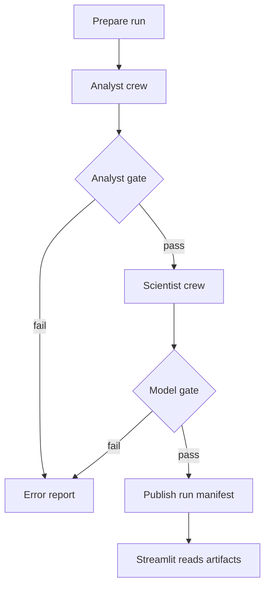

# AI Final Project — Implementation Plan

Use this document in order. Do not start a stage until the previous stage's exit gate passes.

## 1. Locked decisions

| Decision | Choice | Why |
|---|---|---|
| Developer count | Solo | Keep handoffs, tooling, and PRs small enough for one person. |
| Development window | 1–2 weeks; plan targets 10 working days | Leaves one recovery day if finished in two weeks, while still allowing a compressed one-week version. |
| Required path | Connected CrewAI Flow | The one-page alternative proposal needs prior approval and does not satisfy the requested implementation goal. |
| Dataset | Clickstream Data for Online Shopping | Sequential retail behavior is less obvious than sales forecasting, but still small enough for a laptop and a short schedule. |
| ML task | Predict the next main product category in a session | It answers “what is likely to happen next?” and creates a useful interactive demo. |
| Runtime LLM provider | OpenAI | User-selected. Keep the exact model configurable with `OPENAI_MODEL_NAME`; do not hard-code a model that may not exist in the user's account. |
| App | Streamlit only | Fastest way for one developer to combine EDA, model results, inference, and Flow status. Flask would duplicate UI work without helping the rubric. |
| Optional brief items | Excluded | No Supabase and no deployment work. Local execution is the required baseline. |
| Dependency workflow | Python 3.11 + `uv` + pinned lockfile | CrewAI currently supports Python 3.10–3.13 and documents `uv`; 3.11 is a conservative compatibility choice. |
| Model artifact | `model.joblib` plus environment metadata | The brief permits `.joblib`. Only load the trusted artifact produced by this repo because joblib is pickle-based. |

## 2. Brief compliance map

| Mandatory requirement | Planned evidence |
|---|---|
| CrewAI | Two real CrewAI crews orchestrated by one CrewAI Flow. |
| Analyst crew, at least 3 agents | Source/quality analyst, data engineer, business/EDA analyst. |
| Scientist crew, at least 3 agents | Contract/feature engineer, model trainer, evaluation/model-card reviewer. |
| Automated handoff | Flow passes artifact paths and a typed state only after the analyst validation gate. |
| Contract and feature validation | Deterministic Python validators run before the scientist crew and before inference. |
| Reproducibility | Seeded models, chronological split, lockfile, run manifest, hashes, logs, tracked artifacts. |
| Graceful failure | Failed gates stop downstream work and write a concise error report with remediation. |
| Required analyst outputs | `clean_data.csv`, `eda_report.html`, `insights.md`, `dataset_contract.json`. |
| Required scientist outputs | `features.csv`, `model.joblib`, `evaluation_report.md`, `model_card.md`. |
| Python/data stack | Pandas, scikit-learn, Matplotlib, Seaborn. |
| Streamlit or Flask | Streamlit dashboard and inference page. |
| Git/GitHub with PRs | Three feature branches and three documented pull requests, even for solo work. |
| Final repository | Source, tests, artifacts, documentation, and reproducible commands. |
| Business presentation | 10–12 slides; target 11. |
| Demo recording | Script and shot list for a 4–5 minute recording. |

## 3. Dataset decision

### Selected resource

- Kaggle mirror: [Clickstream Data for Online Shopping](https://www.kaggle.com/datasets/tunguz/clickstream-data-for-online-shopping)
- Primary documentation: [UCI dataset record](https://archive.ics.uci.edu/dataset/553/clickstream%2Bdata%2Bfor%2Bonline%2Bshopping)
- Verified facts: 165,474 rows, 14 features, sequential/multivariate data, no missing values reported by the publisher, a 6.4 MB CSV, and CC BY 4.0 licensing.
- Business context: five months of 2008 clickstream data from an online clothing shop.

### Prediction unit

One training row represents click `t` within a shopping session.

- Target: the next click's main product category at `t+1`.
- Group and sort by a verified session key and click order.
- Drop the final click of each session because it has no next-click label.
- Build features only from the current click and earlier clicks in that session.
- Freeze normalized column names only after the downloaded CSV and its data description are inspected. Do not invent columns that are not present.

### Split policy

- Train: April–June.
- Validation: July.
- Test: August.
- If a required class is absent from one split, stop and document a revised month-based split before training.
- Never use random row splitting. Rows from the same session are related, and random splitting would create leakage.

### Model comparison

1. Transition baseline: most common next category for each current category.
2. Multinomial logistic-regression pipeline with one-hot encoding.
3. Random-forest pipeline using the same leakage-safe feature set.

Primary metric: macro F1. Secondary metrics: accuracy, weighted F1, per-class precision/recall, confusion matrix, and log loss when probabilities are available. Macro F1 prevents common categories from hiding poor minority-category performance.

### Why this dataset wins

- More interesting than ordinary revenue forecasting or a ready-made purchase/no-purchase label.
- Sequential structure gives the project a real data-contract and leakage challenge.
- Small enough for repeated local runs, CI samples, and a 1–2 week solo build.
- Has categorical and numeric fields suitable for EDA, feature pipelines, and business interpretation.
- The age of the data is acceptable for a workflow demonstration, but it must be stated as a limitation; it is not evidence of current shopping behavior.

## 4. Product and architecture

### User-facing product

The Streamlit app has four sections:

1. **Overview:** business question, dataset caveats, latest Flow status.
2. **EDA:** embedded/recreated figures and key analyst insights.
3. **Model evaluation:** comparison table, confusion matrix, limitations.
4. **Predict next category:** form for current/past click context; output category, confidence, and a plain-language caveat.

The app reads completed artifacts. A clearly labeled button may start the full Flow locally, but page loading must never spend OpenAI tokens automatically.

### Flow topology



### Boundary between agents and deterministic code

| Work | Owner | Why |
|---|---|---|
| CSV parsing, cleaning, schema checks, feature creation, training, metrics, file writes | Tested Python functions/tools | These steps must be deterministic and numerically correct. |
| Task delegation, interpreting validated results, business summaries, model-card narrative | CrewAI agents | This is where language reasoning adds value. |
| Pass/fail gates and routing | CrewAI Flow calling Python validators | An LLM must not decide whether a schema or required file exists. |
| Final metrics displayed in prose | Generated from machine-readable metrics JSON | Prevents an agent from inventing or rounding inconsistent values. |

### Agent design

| Crew | Agent | Responsibility | Must not do |
|---|---|---|---|
| Analyst | Source & Quality Analyst | Verify source metadata, raw schema, ranges, duplicates, session ordering, license. | Rewrite data or estimate missing facts. |
| Analyst | Data Engineer | Invoke cleaning tool and describe transformations. | Hand-edit CSV output. |
| Analyst | EDA & Business Analyst | Interpret computed tables/figures; write `insights.md` and assemble report. | Calculate unsupported numbers in prose. |
| Scientist | Contract & Feature Engineer | Validate handoff; invoke leakage-safe feature builder. | Use future clicks or test data during feature design. |
| Scientist | Model Trainer | Run configured baseline and two models with fixed seeds. | Select a winner using the test set. |
| Scientist | Evaluation & Governance Reviewer | Compare validation results, evaluate the locked winner once on test, write evaluation and model card. | Hide weak classes or omit limitations. |

Use sequential processes inside each crew. Parallelism adds complexity and no useful speedup because later tasks depend on earlier artifacts.

Runtime prompt files:

| Crew | Agent | Prompt file |
|---|---|---|
| Shared | Every agent | `crewai-agent-prompts/00_shared_runtime_rules.md` |
| Analyst | Source & Quality Analyst | `crewai-agent-prompts/analyst/01_source_quality_analyst.md` |
| Analyst | Data Engineer | `crewai-agent-prompts/analyst/02_data_engineer.md` |
| Analyst | EDA & Business Analyst | `crewai-agent-prompts/analyst/03_eda_business_analyst.md` |
| Scientist | Contract & Feature Engineer | `crewai-agent-prompts/scientist/01_contract_feature_engineer.md` |
| Scientist | Model Trainer | `crewai-agent-prompts/scientist/02_model_trainer.md` |
| Scientist | Evaluation & Governance Reviewer | `crewai-agent-prompts/scientist/03_evaluation_governance_reviewer.md` |

Each file contains the CrewAI role, goal, backstory, task prompt, allowed-tool boundary, stop conditions, and structured output contract. Keep these prompts versioned with the application. Deterministic tools and validators remain authoritative; the agents interpret their outputs and create evidence-linked control records.

### Suggested repository layout

```text
retail-clickstream-ai/
├── app.py
├── pyproject.toml
├── uv.lock
├── .env.example
├── README.md
├── data/
│   └── raw/                         # source CSV ignored; README explains acquisition
├── artifacts/
│   ├── analyst/                     # four required analyst files
│   ├── scientist/                   # four required scientist files + metrics/figures
│   └── runs/                        # logs, run manifest, failure report
├── src/retail_clickstream_ai/
│   ├── config.py
│   ├── flow.py
│   ├── crews/analyst/
│   ├── crews/scientist/
│   ├── pipeline/data.py
│   ├── pipeline/features.py
│   ├── pipeline/modeling.py
│   ├── reporting/
│   └── validation/
├── tests/
│   ├── fixtures/
│   ├── unit/
│   └── integration/
├── docs/
│   ├── decisions/
│   ├── presentation_outline.md
│   └── demo_script.md
└── .github/workflows/ci.yml
```

## 5. Staged implementation

### Stage 1 — Scaffold and freeze acceptance criteria (0.5–1 day)

Do:

- Initialize the repo, `uv`, Python 3.11, package layout, `.env.example`, logging, paths, and test skeleton.
- Pin CrewAI, OpenAI integration dependencies, Pandas, scikit-learn, Matplotlib, Seaborn, Streamlit, joblib, and pytest through `uv.lock`.
- Add a no-secrets policy and configuration validation for `OPENAI_API_KEY` and `OPENAI_MODEL_NAME`.
- Add an acceptance checklist matching Section 2.

Why now: every later prompt needs the same paths, commands, and definition of done. Changing structure after artifacts exist wastes the short schedule.

Exit gate:

- Fresh install succeeds.
- `pytest` runs at least one smoke test.
- Importing the package does not require an API key or make a network call.

Claude prompt: `claude-code-prompts/01_scaffold_and_acceptance.md`

### Stage 2 — Acquire, inspect, and contract the data (1 day)

Do:

- Document Kaggle/manual acquisition without committing credentials.
- Verify the actual CSV, delimiter, 14-column schema, types, category values, session-key uniqueness, order monotonicity, row count, missing values, duplicates, and a SHA-256 hash.
- Normalize names deterministically and create the first `dataset_contract.json`.
- Create a tiny synthetic/derived fixture for tests; never run CI on the whole dataset.

Why now: modeling choices depend on real schema and session semantics. This stage is the explicit anti-hallucination checkpoint.

Exit gate:

- Raw validation either passes or produces an actionable failure report.
- Contract validation passes against a sample and fails on a deliberately broken fixture.

Claude prompt: `claude-code-prompts/02_data_acquisition_and_contract.md`

### Stage 3 — Build the Analyst pipeline and crew (1.5 days)

Do:

- Implement deterministic cleaning, EDA tables/plots, artifact hashing, and HTML report generation.
- Configure and run all three Analyst agents over tool-produced results.
- Produce the four exact required analyst artifacts.
- Keep quantitative facts in JSON/CSV intermediates so generated prose is traceable.

Why now: the Scientist crew is contractually downstream. Building Analyst outputs first makes the handoff real instead of simulated.

Exit gate:

- All four required files exist and are non-empty.
- Contract matches `clean_data.csv` exactly.
- A second run with the same input produces identical cleaned data and equivalent computed metrics.

Claude prompt: `claude-code-prompts/03_analyst_pipeline_and_crew.md`

### Stage 4 — Build features, models, and Scientist crew (2 days)

Do:

- Generate next-click labels inside verified sessions and enforce current/past-only features.
- Implement month-based train/validation/test splits.
- Compare transition baseline, logistic regression, and random forest.
- Choose on validation macro F1; evaluate the locked winner once on August test data.
- Configure and run all three Scientist agents.
- Produce the four exact required scientist artifacts plus machine-readable metrics and figures.

Why now: the hardest technical risk is leakage. Solving and testing it before Flow/UI work avoids presenting invalid results beautifully.

Exit gate:

- Unit tests prove session boundaries and last-click removal.
- Feature columns contain no target or future-derived value.
- `model.joblib` round-trips and reproduces predictions in the pinned environment.
- Evaluation report and model card agree with metrics JSON.

Claude prompt: `claude-code-prompts/04_scientist_pipeline_and_crew.md`

### Stage 5 — Connect the CrewAI Flow and failure routes (1 day)

Do:

- Implement typed Flow state with run ID, status, timestamps, input hash, artifact paths, and errors.
- Connect prepare → Analyst crew → Analyst gate → Scientist crew → model gate → manifest.
- Route every validation failure to a terminal failure handler; never run Scientist tasks after Analyst failure.
- Add mocked-LLM integration tests for success and failure paths.
- Generate the Flow plot if supported by the installed CrewAI version.

Why now: crews and validators are already testable, so orchestration bugs can be isolated from data/model bugs.

Exit gate:

- One end-to-end local run succeeds.
- Corrupting the contract stops the Flow before modeling and writes an actionable error.

Claude prompt: `claude-code-prompts/05_crewai_flow_orchestration.md`

### Stage 6 — Build the Streamlit product (1 day)

Do:

- Implement the four UI sections from Section 4.
- Cache trusted model loading and static data reads.
- Validate form inputs with the same contract used in training.
- Make Flow execution explicit, show progress/failure, and prevent duplicate runs on Streamlit reruns.
- Add headless Streamlit smoke tests.

Why now: the app consumes a stable artifact interface. Building it earlier would create mock paths and rework.

Exit gate:

- App starts with one documented command.
- Inference works from a fresh process.
- Missing or incompatible artifacts produce a helpful UI message, not a stack trace.

Claude prompt: `claude-code-prompts/06_streamlit_app.md`

### Stage 7 — Hardening, CI, and repository documentation (1 day)

Do:

- Complete unit/integration/UI tests, linting, formatting, type checks, and GitHub Actions.
- Run CI without secrets and without paid LLM calls; mock CrewAI/OpenAI boundaries.
- Write setup, data acquisition, run, test, architecture, troubleshooting, limitations, and artifact documentation.
- Run a clean-clone rehearsal.

Why now: documentation written before the interfaces stabilize becomes stale; leaving it to the final hour creates unreproducible demos.

Exit gate:

- CI passes from a clean environment.
- README commands work exactly as written.
- Required artifacts and rubric checklist are complete.

Claude prompt: `claude-code-prompts/07_quality_ci_and_documentation.md`

### Stage 8 — Presentation and demo package (0.5–1 day)

Do:

- Write an 11-slide business-first outline.
- Write a 4–5 minute demo script and shot list.
- Rehearse once with a completed run and once with a controlled validation failure.
- Freeze a release tag only after the final artifact manifest is generated.

Why now: the presentation should report the finished evidence, not planned metrics. Showing a failure path proves the Flow requirement visibly.

Exit gate:

- 10–12 slide content exists.
- Timed rehearsal is no more than 5 minutes.
- Every demo claim is traceable to a repository artifact.

Claude prompt: `claude-code-prompts/08_presentation_and_demo.md`

## 6. Ten-day schedule

| Day | Focus | Result |
|---|---|---|
| 1 | Stage 1 + begin Stage 2 | Reproducible repo and verified raw input path. |
| 2 | Finish Stage 2 | Contract and data tests pass. |
| 3–4 | Stage 3 | Analyst crew artifacts complete. |
| 5–6 | Stage 4 | Leakage-safe models and Scientist artifacts complete. |
| 7 | Stage 5 | End-to-end Flow and failure routing work. |
| 8 | Stage 6 | Streamlit demo works. |
| 9 | Stage 7 | CI, README, clean-clone test complete. |
| 10 | Stage 8 | Slides, demo recording plan, release candidate. |

Compressed one-week version: keep all gates, but use only logistic regression and random forest, limit EDA to five strong plots, and keep Streamlit to one multipage-style script. Do not cut tests for session leakage, contract validation, or Flow failure routing.

## 7. Git and pull-request plan for one developer

| Branch / PR | Contents | Why this grouping |
|---|---|---|
| `feature/data-analyst` | Stages 1–3 | One reviewable vertical slice ending in the Analyst contract. |
| `feature/model-flow` | Stages 4–5 | Modeling and its orchestration share the same handoff interface. |
| `feature/app-release` | Stages 6–8 | UI, documentation, and demo stabilize the release. |

For every PR: link checklist items, include tests run, list generated artifacts, add screenshots when relevant, and perform a self-review from the GitHub diff before merge. Never commit `.env`, Kaggle credentials, or `OPENAI_API_KEY`.

## 8. Test strategy

| Layer | Required checks | Why |
|---|---|---|
| Data unit tests | Delimiter/schema, normalization, duplicate policy, session ordering, allowed ranges. | Stops bad input before costly agents/models run. |
| Feature unit tests | Shift stays within session, last click dropped, past-only aggregates, split boundaries. | Prevents the highest-risk leakage bugs. |
| Model tests | Fixed seed, pipeline input schema, metric calculation, save/load prediction parity. | Makes evaluation and app inference consistent. |
| Contract tests | Valid data passes; missing column, bad type, and forbidden category fail with clear messages. | Proves automated handoff validation. |
| Flow integration tests | Happy path and Analyst-gate failure with mocked crews/LLM. | Proves routing without API cost or flaky network. |
| UI smoke tests | Dashboard loads, artifact error shown, prediction form returns a result. | Protects the demo path. |
| Manual acceptance | Full OpenAI-backed run, Streamlit walkthrough, controlled failure, clean clone. | Covers external/runtime behavior that mocks cannot prove. |

## 9. Risk controls

| Risk | Control | Trigger to stop |
|---|---|---|
| Dataset schema differs from documentation | Inspect the downloaded data description and generate the contract from observed columns. | 14 columns or session/order semantics cannot be verified. |
| Leakage inflates scores | Month split, session-aware target shift, explicit future-feature tests. | Any feature reads `t+1` or later, except target creation. |
| LLM fabricates metrics | Agents receive computed metrics; reports are checked against metrics JSON. | A report contains a number absent from machine output. |
| OpenAI cost/rate limits | Sequential crews, concise task context, no app autorun, mocked CI. | Repeated retries or unbounded agent loops. |
| Dependency drift | Commit `uv.lock` and model environment metadata. | Fresh install or model load differs from training environment. |
| Joblib security | Load only repo-produced artifact and verify its hash. | Artifact origin/hash is unknown. |
| Schedule slips | Protect core gates; trim plot count and UI polish first. | Stage 4 not complete by end of day 6. |
| Old dataset misrepresented | State 2008 time period in UI, report, model card, and slides. | Any claim implies present-day customer behavior. |

## 10. Definition of done

- All eight brief-mandated artifacts exist at the documented paths.
- Both crews contain at least three configured agents and execute through CrewAI.
- The Flow automatically hands off only after deterministic validation.
- Happy path and controlled failure path are demonstrated.
- The model comparison is leakage-safe and the final test set is used once.
- Streamlit presents EDA, evaluation, inference, and honest limitations.
- Tests and CI pass without secrets or paid API calls.
- README reproduces install, data acquisition, Flow run, tests, and app start.
- Three GitHub PRs document the work.
- An 11-slide outline and ≤5-minute demo script are ready.

## 11. Non-blocking configuration choices

These do not require another architecture decision:

- Set `OPENAI_MODEL_NAME` in local `.env` to an OpenAI model available to the user's account; tests must not depend on that exact model.
- If Kaggle CLI credentials are unavailable, manually download the same Kaggle resource and place the CSV at the documented raw-data path. Never fabricate data.
- Use `model.joblib`, not `model.pkl`, because the brief explicitly allows either.

## 12. Verified references (checked 2026-08-06)

- [Kaggle dataset page](https://www.kaggle.com/datasets/tunguz/clickstream-data-for-online-shopping)
- [UCI primary dataset record and CC BY 4.0 license](https://archive.ics.uci.edu/dataset/553/clickstream%2Bdata%2Bfor%2Bonline%2Bshopping)
- [CrewAI installation and supported Python range](https://docs.crewai.com/en/installation)
- [CrewAI Flow guide](https://docs.crewai.com/en/guides/flows/first-flow)
- [CrewAI OpenAI/LLM configuration](https://docs.crewai.com/en/learn/llm-connections)
- [CrewAI agent configuration and role/goal/backstory fields](https://docs.crewai.com/v1.15.10/en/concepts/agents)
- [CrewAI task context and structured-output fields](https://docs.crewai.com/v1.15.9/en/concepts/tasks)
- [CrewAI production guidance for task guardrails and structured outputs](https://docs.crewai.com/v1.15.10/en/concepts/production-architecture)
- [Streamlit caching](https://docs.streamlit.io/develop/api-reference/caching-and-state)
- [Streamlit app testing](https://docs.streamlit.io/develop/api-reference/app-testing)
- [scikit-learn model persistence and security limits](https://scikit-learn.org/stable/model_persistence.html)
